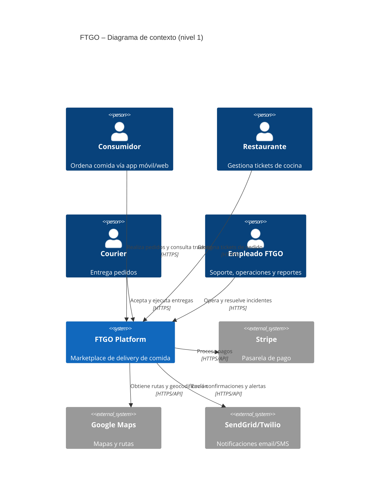
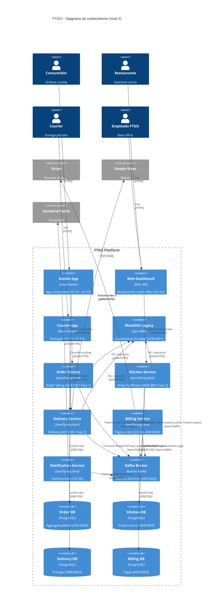

# C4 — FTGO (Nivel 1 Contexto + Nivel 2 Contenedores)

**Versión del artefacto:** `v1`  
**Prompt:** `PR-C4-FTGO-001` / `v2`  
**Fuentes:** [`PRD_v2.md`](../prd/PRD_v2.md) · [`FSD_v1.md`](../fsd/FSD_v1.md) · [ADR-0001](../adr/ADR-0001.md) · [ADR-0002](../adr/ADR-0002.md) · [ADR-0003](../adr/ADR-0003.md) · [Brief Anexo A](../contexto.md)  
**Estado:** Generado (laboratorio)

---

## 1. Introducción

Diagramas C4 del marketplace FTGO en migración **Strangler Fig** [ADR-0001](../adr/ADR-0001.md): nivel 1 (contexto) según stakeholders [Brief §A.2](../contexto.md#a2-stakeholders); nivel 2 (contenedores) alineado a **IPC híbrido REST + Kafka** [ADR-0002](../adr/ADR-0002.md) y **DB por dueño + outbox** [ADR-0003](../adr/ADR-0003.md).

**Archivos Mermaid:**

| Archivo | Nivel |
| --- | --- |
| [`c4_context.mmd`](c4_context.mmd) | 1 — Contexto |
| [`c4_container.mmd`](c4_container.mmd) | 2 — Contenedores |

---

## 2. Diagrama de contexto (Nivel 1)

Ver fuente: [`c4_context.mmd`](c4_context.mmd)

### Trazabilidad Nivel 1

| Elemento | Origen |
| --- | --- |
| Consumidor, Restaurante, Courier, Empleado FTGO | [Brief §A.2](../contexto.md#a2-stakeholders) |
| FTGO Platform | [Brief §A.1](../contexto.md#a1-contexto-de-negocio) |
| Stripe, Google Maps, SendGrid/Twilio | [Brief §A.2](../contexto.md#a2-stakeholders) |

---

## 3. Diagrama de contenedores (Nivel 2)

Ver fuente: [`c4_container.mmd`](c4_container.mmd)

Refleja **fase intermedia Strangler**: monolito legacy convive con Order, Kitchen, Delivery, Billing y Notification services; **Kafka** como bus de eventos [ADR-0002](../adr/ADR-0002.md); **4 BDs** (Order, Kitchen, Delivery, Billing) sin acceso cruzado [ADR-0003](../adr/ADR-0003.md).

### Trazabilidad Nivel 2

| Contenedor | ADR / UC / Brief |
| --- | --- |
| Monolith Legacy | [ADR-0001](../adr/ADR-0001.md) Strangler |
| Order / Kitchen / Delivery Service | [ADR-0001](../adr/ADR-0001.md) Fases 1–3 |
| Kafka Broker | [ADR-0002](../adr/ADR-0002.md) |
| Order/Kitchen/Delivery/Billing DB | [ADR-0003](../adr/ADR-0003.md) |
| Mobile / Web / Courier apps | [FSD UC-01..06](../fsd/FSD_v1.md) |
| Stripe, Maps, SendGrid/Twilio | [Brief §A.2](../contexto.md#a2-stakeholders) |

---

## 4. Coherencia con ADRs (checklist)

| Check | Cumple | Evidencia |
| --- | --- | --- |
| Broker Kafka si async | Sí | `kafka` + relaciones `async/Kafka` |
| DB-per-service | Sí | 4 BDs; solo servicio dueño accede a su BD |
| Monolito en transición | Sí | `legacy` + ACL JSON/HTTPS |
| Sin detalle interno en N1 | Sí | Solo System FTGO + externos |
| Tech/protocolo en relaciones N2 | Sí | 22/22 relaciones (100 %) |

---

## Métricas

### Ejecución 1 — 2026-05-23T19:00:00-04:00

- **Prompt:** `PR-C4-FTGO-001` / `v2`
- **Run ID:** `20260523-190000-0400-c4`

| Nombre de la métrica | Valor | Insights |
| --- | ---: | --- |
| Sintaxis Mermaid válida | true | Bloques C4Context/C4Container cerrados; IDs sin espacios. |
| # contenedores (count) | 13 | 3 apps + legacy + 5 servicios + kafka + 4 BDs (≥8 requerido). |
| # relaciones con tecnología/protocolo | 22 | 100 % relaciones N1+N2 con protocolo explícito. |
| Trazabilidad (%) | 100 | Personas/sistemas §A.2; contenedores ADR-0001..0003 y FSD UC. |
| Reducción de iteraciones (%) | 0 | Primera generación C4 del repositorio. |
| Ediciones humanas (count) | 0 | Generación automatizada. |
| Inventado / Hallucination (%) | 0 | Sin sistemas externos fuera del brief. |
